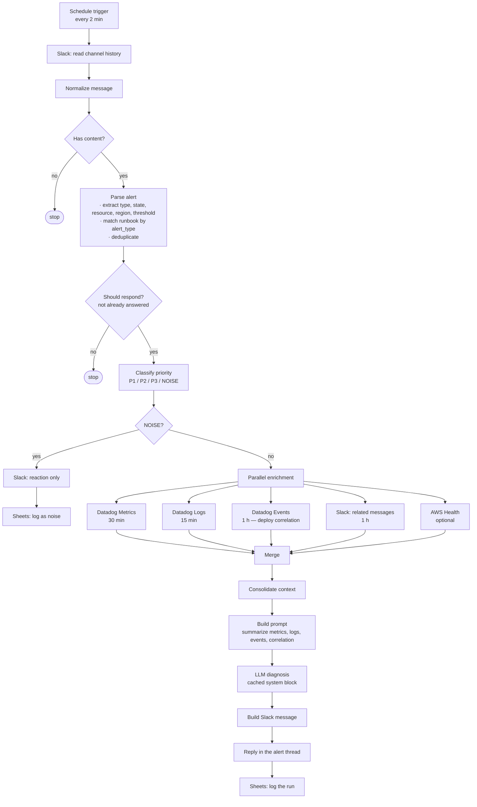

# NOC Bot

[](https://github.com/JuanCoder23/noc-bot/actions/workflows/ci.yml)

Automated first-line triage for infrastructure alerts in a 24/7 NOC, built as a self-hosted n8n workflow. It reads alerts from a Slack channel, deduplicates and classifies them, enriches what survives from observability APIs, asks an LLM for a diagnosis grounded in a runbook catalog, and answers in the alert's own Slack thread.

It ran in production against a multi-region payments platform, handling on the order of a thousand alerts a month.

## Running it

The logic that decides what happens to an alert — parsing, deduplication, the
response gate, priority scoring, prompt assembly and message rendering — is
extracted from the workflow's code nodes into `src/`, so it runs and is tested
without n8n, Datadog credentials, or a model API key.

```bash
npm test       # 275 assertions, no dependencies
npm run demo   # trace one sample alert through every stage
npm run replay # replay a generated dataset through the whole pipeline, offline
```

`npm run demo -- lambda-errors` traces any file in [`samples/alerts/`](samples/alerts).
The enrichment calls are stubbed; everything else is the code that ran in production.

### Running the whole pipeline against a synthetic dataset

```bash
npm run dataset   # generate a seeded dataset of synthetic alerts
npm run replay    # push one through dedupe → gate → classify → enrich → prompt → message
```

`npm run replay` generates and replays in one step, writes a JSON report to
`out/report.json`, and prints a summary. It makes **no network calls**:
enrichment and the model are stubbed deterministically, so the run needs no
Datadog credentials and no API key, and costs nothing.

The generator is seeded — same seed, same dataset, byte for byte — so no
dataset is committed to the repository. The seed is the artefact. It produces
alerts in the shape `parseDatadogAlert` expects, covering the 12 alert types
the parser can actually emit, and is parameterised by volume, time window, the
mix of noise against incidents, and bursts of the same alert repeated to
exercise all three deduplication layers.

```bash
npm run dataset -- --seed incident-night --count 500 --window 180 --noise 0.4
npm run dataset -- --print 2          # show records instead of writing a file
npm run replay  -- --single-pass      # one pass instead of replaying the 2-minute poll
npm run replay  -- --help
```

By default the harness replays the real trigger rather than making a single
pass: a read every 2 minutes over a 5-minute window, exactly as
[`docs/architecture.md`](docs/architecture.md) describes it. The overlap is
deliberate in production and reproduced here, which is why the replay reads
far more records than the dataset contains — and why deduplication across runs
gets exercised instead of assumed.

#### What a run looks like

> **These figures describe synthetic data.** They are properties of the
> generator and of the pipeline's logic, not measurements of production
> traffic. Nothing in this repository is derived from any real alert. The
> output below is reproduced by `npm run replay -- --no-timings`, which uses
> the default seed `noc-demo`.

```
SYNTHETIC REPLAY — seed "noc-demo", poll mode
────────────────────────────────────────────────────────────────
  333 generated records over 120 simulated minutes
  63 polls every 120s over a 300s read window
  835 reads, because the windows overlap on purpose

  deduplication   358 survived, 477 dropped
                  planted duplicates: exact_ts 143, exact_text 74, same_key 39
                  re-reads across polls: 197, incidental collisions: 24

  response gate   123 passed, 235 rejected
                    90  recovered
                    87  already_answered
                    46  no_state
                    12  slack_subtype

  priority        (of the 123 that passed the gate)
  P1              41   33.3%
  P2              33   26.8%
  P3              30   24.4%
  NOISE           19   15.4%

  reached diagnosis   104  (31.2% of generated records)
  NOISE stopped early 19  — no enrichment call, no model call
```

Three things in that output are worth reading carefully, because they are
properties of the pipeline rather than of the dataset:

- **The NOISE share is not a tuning result.** NOISE is only reachable from a
  `WARN` alert — the classifier caps anything in `TRIGGERED` or `RE-TRIGGERED`
  at 69, below the NOISE threshold. Generating a dataset that is entirely
  noise-shaped but entirely firing produces a NOISE count of zero, which is
  the fail-safe described under [Design decisions](#fail-safe-classification-instead-of-accurate-classification)
  doing its job. `test/replay.test.js` asserts exactly that.
- **`already_answered` is the largest rejection category after recoveries**,
  and it is almost entirely the overlapping read window catching the same
  alert again. That is deduplication earning its place, not alerts being lost.
- **Stage timings are not latency.** The report includes per-stage wall-clock
  time, but with enrichment and the model stubbed it measures in-process work
  only. Real latency is dominated by the 2-minute polling interval and by five
  network calls per alert, neither of which is represented.

The report carries all of this in its own `notes` field, so a figure lifted
out of `out/report.json` travels with the caveats attached.

### Seeing it in n8n

```bash
docker compose up -d
open http://localhost:5678
```

This starts n8n with `workflows/NOC_bot.json` already imported — no manual import,
and no dependency on the host's Node version. n8n asks you to create a local owner
account on first visit; it is stored in the container volume and goes no further.
The workflow is imported inactive, so nothing polls until you activate it.

`docker compose down` stops it; add `-v` to discard the n8n database as well.

### Repository layout

| Path | What |
|---|---|
| `compose.yaml` | Runs n8n locally with the workflow already imported |
| `workflows/NOC_bot.json` | The n8n export — import this to actually run the pipeline |
| `src/` | The code nodes extracted as modules, so they can be read and tested |
| `tools/synth/` | Seeded generator for synthetic Datadog alerts |
| `tools/harness/` | Replays a dataset through the pipeline with enrichment and the model stubbed |
| `test/` | Test suites and the dependency-free runner |
| `samples/alerts/` | Synthetic Datadog alerts the tests and demo run against |
| `scripts/validate-workflow.js` | CI guard: the export stays credential-free and its catalog stays synthetic |
| `docs/architecture.md` | Data flow, error handling, known failure modes |

The modules are extracted from the export rather than reimplemented, and CI
checks the two do not drift apart — otherwise the tests would stop testing what
actually runs.

## The problem

A 24/7 NOC receives alerts continuously, and the first-line operator handling them has to answer the same question every time before anything else can happen: is this real, and what does the runbook say to do about it. Answering it means leaving Slack and opening Datadog for the metric, then again for the logs, then again for recent deploy events, then the AWS console for the service state, then the runbook document to find the escalation threshold for that specific alert type. Each of those steps is fast on its own. Done twenty times an hour, at 3am, by an operator who is also watching everything else, they are the bulk of the time between an alert firing and someone knowing whether it matters.

The cost is not evenly distributed. Most alerts are noise — a monitor whose threshold sits too close to normal traffic, a metric flapping around its limit, the same underlying condition firing five times in half an hour. Those consume the same manual lookup as a real incident, and the time they consume is taken from the real incident. Worse, the volume itself trains operators to skim, which is precisely when a genuine payment-path failure gets read as more of the same. The goal was not to decide incidents automatically. It was to put the lookup work that precedes the decision into the thread before the operator gets there, so the human judgment happens against assembled evidence instead of against a one-line alert.

## Architecture



[`docs/architecture.md`](docs/architecture.md) covers the data flow stage by stage, the deduplication layers, the priority scoring table, and the error handling — including the failure modes this implementation still has.

### Stack

| Component | Used for |
|---|---|
| n8n (self-hosted) | Workflow runtime, scheduling, per-workflow state for deduplication |
| Slack API | Alert ingestion, correlation lookup, threaded replies, reactions |
| Datadog Metrics API (`v1/query`) | Metric window around the alert |
| Datadog Logs API (`v2/logs/events/search`) | Recent logs for the affected resource |
| Datadog Events API (`v1/events`) | Deploy and change correlation |
| AWS Health API (`DescribeEvents`) | Provider-side incidents in the alert's region |
| Anthropic API (`claude-haiku-4-5`) | Diagnosis, with a cached system block |
| Google Sheets API | Run log for auditing |

## Design decisions

### Fail-safe classification instead of accurate classification

The priority classifier scores each alert from 0 to 100 and routes anything above 70 to a NOISE branch that only leaves a Slack reaction and a log row. The scoring is deliberately asymmetric: an alert in `TRIGGERED` or `RE-TRIGGERED` state has its score capped at 69, which means it can never be classified as NOISE regardless of how noisy every other signal says it is. Repeat firing, a metric barely over its threshold, a monitor known to flap — all of those push the score up, and none of them can push it past the cap while the monitor still says the condition is active.

**Tradeoff.** This guarantees a worse false-positive rate than a classifier tuned for accuracy would produce, and the NOISE branch is correspondingly conservative. That is the intended trade: on a payments platform, the cost of silencing one real incident is not comparable to the cost of an unnecessary page. A classifier optimized for balanced accuracy would trade those two errors as if they were equivalent, and they are not.

### Prompt caching instead of trimming context

The runbook catalog and the response instructions live in a system block marked `cache_control: ephemeral`, and the per-alert evidence is the only thing that varies between calls. The alternative was to cut the catalog down to whatever fit in a budget, or to select a subset of runbooks per call.

**Tradeoff.** The cached block has to stay byte-identical to be reused, so the catalog cannot be edited casually — a change invalidates the cache for every subsequent alert until it warms again, and cache writes cost more than uncached input. In exchange, the model sees the full catalog on every call instead of a pre-filtered slice, which keeps the retrieval mistake out of the pipeline: the model is never asked to diagnose an alert whose runbook was dropped before it saw it.

### Deduplication before enrichment, not after

Deduplication happens inside the parsing step, before any enrichment call is made — by message timestamp, by identical message text, and by `alert_type` + resource. Alerts that survive that are filtered again by the NOISE branch, which also runs before enrichment. Only what gets past both fans out to the five enrichment calls.

**Tradeoff.** Deduplicating this early means the decision is made on the alert text alone, without the enrichment data that might have distinguished two superficially identical alerts, so it will occasionally collapse two genuinely distinct events. That is accepted because of when the failure would otherwise land. A large incident is exactly when the same alert fires dozens of times, and it is also exactly when the enrichment APIs must stay available. Deduplicating after enrichment would fan out every duplicate to five API calls and burn the rate limit budget during the incident that needs it most.

### The diagnosis goes to the Slack thread, not to a dashboard

The output is posted as a reply in the thread of the original alert, and the run is logged to Sheets separately for auditing.

**Tradeoff.** A dashboard would give better aggregate views, filtering, and history than a Slack thread does, and the Sheets log is a poor substitute for that. But the operator is already in Slack when the alert arrives — that is where the alert was read, and where the handoff and the escalation will be written. Putting the diagnosis anywhere else adds a context switch at the exact moment the design is trying to remove one, and a dashboard nobody opens at 3am has no effect on time to diagnosis.

## What it does not do

- **It does not decide incidents.** Every diagnosis is a suggestion posted for a human, and it always names an explicit escalate/do-not-escalate recommendation with the reason. Nothing is auto-remediated, nothing is auto-closed, and the bot has no write access to any infrastructure.
- **It does not retry failed calls.** No node is configured with retry-on-fail. Enrichment calls that time out or return an error degrade to empty context rather than being retried; the diagnosis proceeds with whatever came back.
- **It can mark an alert answered without answering it.** Deduplication state is written when the response gate passes, before the reply is sent. A run that aborts after that point suppresses the alert for the next 10 minutes without having replied and without writing a log row. This is documented in `docs/architecture.md` and is the sharpest gap in the current implementation.
- **It does not survive a re-import.** Deduplication state lives in n8n's per-workflow static data, scoped to the instance. Reimporting or resetting the workflow clears it.
- **It is polling, not event-driven.** The trigger runs every 2 minutes, so worst-case ingestion latency is one full interval. There is no webhook path.
- **It reads one channel.** The workflow is configured against a single Slack channel; multiple channels means multiple copies.
- **Correlation is textual.** Related-alert detection is substring matching over recent channel messages, not a topology or dependency model.
- **Nine of its alert types are unreachable.** The runbook mapping covers 21 alert types but the parser can only ever emit 12, so those runbooks can never be selected — including `FLAP_DETECTION`, which leaves the classifier's inherently-noisy branch as dead code. `test/coverage.test.js` pins this so closing the gap shows up as a failing test.
- **The runbook catalog here is synthetic.** See [Note on data](#note-on-data).

## Installation

### Prerequisites

- [n8n](https://n8n.io/) — self-hosted or cloud
- A Datadog account with API and Application keys
- A Slack app with `channels:history`, `chat:write`, and `reactions:write` on the target channel
- Google Sheets API access
- An Anthropic API key
- Optionally, AWS credentials with `health:DescribeEvents`

### Setup

1. Clone the repository.

   ```bash
   git clone https://github.com/JuanCoder23/noc-bot.git
   cd noc-bot
   ```

2. Copy the environment template and fill it in.

   ```bash
   cp .env.example .env
   ```

3. Import `workflows/NOC_bot.json` in n8n via **Workflows → Import from File**. The workflow is exported inactive. (`docker compose up -d` does this step for you against a local n8n.)

4. Replace the placeholders the export ships with. Each is a literal string in the workflow, so searching for `YOUR_` finds all of them.

   | Placeholder | Where | Set to |
   |---|---|---|
   | `YOUR_SLACK_CHANNEL_ID` | 3 Slack nodes | The channel the bot watches |
   | `YOUR_GOOGLE_SHEET_ID` | 2 Sheets nodes | The spreadsheet used as run log |
   | `YOUR_DD_API_KEY`, `YOUR_DD_APP_KEY` | 3 Datadog nodes | Your Datadog keys |
   | `YOUR_ANTHROPIC_API_KEY` | LLM node header | Your Anthropic key |
   | `YOUR_SLACK_USER_ID` | Final message node | Whoever should be tagged on each diagnosis |
   | `YOUR_CREDENTIAL_ID` | Slack, Sheets, AWS nodes | Reconnect these in the n8n credentials UI |

   The Datadog and Anthropic keys are passed as plain header parameters on the HTTP nodes rather than as n8n credential objects, so they live in the workflow body. Move them to n8n credentials if that matters for your setup.

5. Create the n8n credentials the nodes expect: Slack (OAuth2 or bot token), Google Sheets (OAuth2 or service account), and AWS (IAM) if AWS Health is used.

6. Create the run-log sheet with these columns, in order:

   ```
   timestamp, alert_type, state, severity, resource, region, runbook_id,
   runbook_source, response_time_ms, ai_provider, ai_success, tokens_used,
   thread_ts, channel, message_preview, priority, noise_score,
   classification_reason, metric_value
   ```

7. Replace the synthetic runbook catalog in the `Parsear Alerta` node and the condensed catalog in the LLM system block with your own, keeping the same structure.

8. Activate the workflow.

### Environment variables

| Variable | Description |
|---|---|
| `ANTHROPIC_API_KEY` | Anthropic API key |
| `DD_API_KEY` | Datadog API key |
| `DD_APP_KEY` | Datadog application key |
| `DD_SITE` | Datadog site, e.g. `datadoghq.com` |
| `SLACK_CHANNEL_ID` | ID of the channel the bot watches |
| `GOOGLE_SHEET_ID` | ID of the run-log spreadsheet |

## Note on data

This repository contains no employer or client data of any kind. Specifically:

- **No credentials.** No API keys, tokens, webhook URLs, account identifiers, or credential IDs. Every such value is a `YOUR_*` placeholder, and the git history carries none either.
- **No runbook content.** The runbook catalog in `workflows/NOC_bot.json` is three synthetic examples written for this repository. They show the structure the lookup expects. The real catalog, its thresholds, and its escalation matrix are not here.
- **No identifiers.** No Slack channel IDs, member IDs, spreadsheet IDs, AWS account IDs, hostnames, internal endpoints, or service names.
- **No names.** No employer name, client names, or colleague names.
- **No operational data.** No captured alerts, logs, metrics, model outputs, or run logs.
- **The alert dataset is generated, not captured.** Everything `tools/synth`
  produces is invented: every service, queue, database, function, API, load
  balancer and monitor name carries a `synth-` prefix, every alert text closes
  with a `[SYNTHETIC DATA ...]` marker, every record is flagged `synthetic:
  true`, stubbed evidence is tagged `source:synthetic-stub`, and the stubbed
  model reply opens with `SYNTHETIC STUB - not a model output`. That marking is
  designed to survive the whole pipeline, so it is still visible in the
  rendered Slack message — the artefact most likely to end up in a screenshot.
  Any figure quoted from a replay report must say it comes from synthetic
  data.

What is published is the pipeline: the workflow structure, the parsing and classification logic, and the design reasoning. The operational data the system produced, and a companion workflow that generated a weekly operations report, stayed with the employer and are not part of this repository.

## Roadmap

- [x] Containerize the n8n deployment with Docker — `docker compose up -d`, workflow pre-imported
- [x] CI in GitHub Actions — tests on Node 18/20/22, plus a guard that the workflow export stays credential-free and in sync with `src/`
- [x] Lint the extracted modules — ESLint over `src/` and `test/`, enforced in CI
- [ ] Deploy to k3s
- [ ] Provision the infrastructure with Terraform
- [x] Rebuild against a synthetic alert dataset, so the pipeline is runnable end to end from this repository alone — `npm run dataset`, `npm run replay`

## License

MIT — see [LICENSE](LICENSE).
