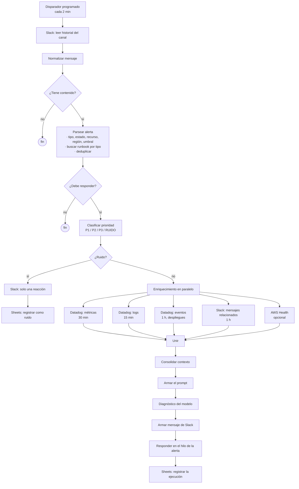

# NOC Bot

[](https://github.com/JuanCoder23/noc-bot/actions/workflows/ci.yml)

Triaje automático de primera línea para alertas de infraestructura, construido como un flujo de n8n. Lee las alertas de un canal de Slack, descarta duplicados y ruido, reúne contexto de Datadog y AWS, le pide a un modelo de lenguaje un primer diagnóstico apoyado en un catálogo de runbooks y responde en el hilo de la propia alerta.

> **Aclaración.** Este repositorio es la versión pública y de demostración del bot de triaje que construí y operé como Monitoring Engineer en Simetrik. No es el sistema de producción: no contiene datos, credenciales, identificadores ni runbooks de la empresa, y todo lo que se ejecuta aquí usa **datos sintéticos**. La sección [Resultados](#resultados) separa lo que medí en el trabajo de lo que se puede reproducir con este repositorio.

## El problema

En un NOC que opera 24/7, quien atiende una alerta tiene que responder siempre lo mismo antes de poder hacer cualquier otra cosa: ¿esto es real?, ¿y qué dice el runbook que hay que hacer? Para responderlo hay que salir de Slack, abrir Datadog para ver la métrica, luego los logs, luego los despliegues recientes, después la consola de AWS y por último el runbook. Cada paso es rápido por separado. Repetidos en cada alerta, de madrugada y mientras se vigila todo lo demás, son la mayor parte del tiempo que pasa entre que una alerta se dispara y alguien sabe si importa.

Además, la mayoría de las alertas son ruido: un umbral demasiado cerca del tráfico normal, una métrica que oscila alrededor de su límite, la misma condición disparándose cinco veces en media hora. Ese ruido consume la misma revisión manual que un incidente real y acostumbra a leer por encima, que es justo cuando un fallo de verdad se confunde con uno más.

El objetivo no era que el bot decidiera incidentes. Era dejar la búsqueda de contexto ya hecha en el hilo antes de que la persona llegara, para que su criterio se aplicara sobre evidencia reunida y no sobre una alerta de una línea.

## La solución

1. **Leer.** Cada 2 minutos el flujo lee el historial del canal de alertas.
2. **Deduplicar.** Descarta repeticiones por marca de tiempo, por texto idéntico y por tipo de alerta más recurso.
3. **Decidir si responde.** No responde a alertas recuperadas ni a las que ya contestó.
4. **Clasificar.** Asigna prioridad P1, P2, P3 o RUIDO. Una alerta que sigue activa nunca se clasifica como ruido.
5. **Enriquecer.** Solo para lo que no es ruido, consulta en paralelo métricas, logs y eventos de Datadog, mensajes relacionados en Slack y AWS Health.
6. **Diagnosticar.** Envía la evidencia y el catálogo de runbooks al modelo, que devuelve un primer diagnóstico con una recomendación explícita de escalar o no.
7. **Responder y registrar.** Publica el resultado en el hilo de la alerta y guarda una fila por ejecución en Google Sheets.

El bot no remedia nada ni cierra nada: no tiene permisos de escritura sobre la infraestructura. Todo diagnóstico es una sugerencia para una persona.

## Arquitectura



[`docs/architecture.md`](docs/architecture.md) (en inglés) describe el flujo de datos etapa por etapa, las capas de deduplicación, la tabla de puntuación de prioridad y el manejo de errores, incluidos los modos de fallo que esta implementación todavía tiene.

| Componente | Para qué se usa |
|---|---|
| n8n | Ejecuta el flujo, lo programa y guarda el estado de deduplicación |
| Slack API | Leer alertas, buscar mensajes relacionados, responder en hilo |
| Datadog API | Métricas, logs y eventos alrededor de la alerta |
| AWS Health API | Incidentes del proveedor en la región de la alerta |
| Anthropic API (`claude-haiku-4-5`) | Primer diagnóstico |
| Google Sheets API | Registro de cada ejecución |
| Node.js | Los nodos de código del flujo, extraídos a `src/` para poder probarlos |
| GitHub Actions | Pruebas, validación del flujo y lint |

## Cómo correrlo

Hace falta Node.js 22 o superior. Las pruebas, la demo y el replay no necesitan n8n, credenciales de Datadog ni una clave de API, y no hacen llamadas de red.

```bash
git clone https://github.com/JuanCoder23/noc-bot.git
cd noc-bot
npm test          # 281 comprobaciones, sin dependencias
npm run demo      # sigue una alerta de ejemplo por todas las etapas
npm run replay    # genera un conjunto de alertas sintéticas y lo pasa por todo el flujo
```

`npm run demo -- lambda-errors` sigue cualquiera de los archivos de [`samples/alerts/`](samples/alerts).

Para ver el flujo en n8n:

```bash
docker compose up -d
```

Esto levanta n8n en `http://localhost:5678` con [`workflows/NOC_bot.json`](workflows/NOC_bot.json) ya importado e inactivo, así que no consulta nada hasta que se active. Para conectarlo a servicios reales, ver [Instalación con credenciales propias](#instalación-con-credenciales-propias).

### Estructura del repositorio

| Ruta | Contenido |
|---|---|
| `workflows/NOC_bot.json` | La exportación del flujo de n8n |
| `src/` | La lógica de los nodos de código como módulos de Node.js |
| `test/` | Las pruebas y un ejecutor sin dependencias |
| `samples/alerts/` | Alertas sintéticas con formato de Datadog |
| `tools/synth/` | Generador de alertas sintéticas con semilla |
| `tools/harness/` | Replay del flujo completo con el enriquecimiento y el modelo simulados |
| `scripts/validate-workflow.js` | Validación que el CI aplica a la exportación del flujo |
| `compose.yaml` | n8n en local con el flujo importado |
| `docs/architecture.md` | Flujo de datos, manejo de errores y modos de fallo conocidos |

## Resultados

### En Simetrik (experiencia profesional)

Estos resultados son del sistema que operé en el trabajo. Los datos con los que se midieron pertenecen a la empresa y no están en este repositorio.

- El canal recibía unas **900 alertas al mes** y la gran mayoría era ruido: en el último trimestre hubo alrededor de 10 incidentes reales.
- El bot generaba el primer diagnóstico de cada alerta y guardaba su propia telemetría en Google Sheets: tiempo de respuesta, alertas atendidas y tiempo de resolución del ingeniero.
- Con esa telemetría medí una **reducción del 54 % en el MTTR**.
- Las respuestas de ingeniería sobre cada diagnóstico se guardaban y servían de contexto para los siguientes.
- Entregué el bot al resto del equipo de monitoreo.

El sistema del trabajo y este repositorio no son iguales:

| | Bot en Simetrik | Este repositorio |
|---|---|---|
| Implementación | Python y n8n | JavaScript en nodos de n8n |
| Fuentes de contexto | AWS, Datadog, RDS y Snowflake | Datadog, Slack y AWS Health |
| Modelo | Claude Sonnet 4.5 | Claude Haiku 4.5 |
| Contexto para el modelo | Casos anteriores similares, recuperados en cada consulta | Catálogo fijo de 3 runbooks sintéticos |
| Ciclo de retroalimentación | Sí | No |
| Datos | De la empresa | Sintéticos |

### En este repositorio (datos sintéticos)

Lo siguiente se reproduce con `npm run replay -- --no-timings`, que usa la semilla `noc-demo`. **Son cifras de datos generados**: describen el generador y la lógica del flujo, no tráfico real.

```
SYNTHETIC REPLAY — seed "noc-demo", poll mode
────────────────────────────────────────────────────────────────
  333 generated records over 120 simulated minutes
  63 polls every 120s over a 300s read window
  835 reads, because the windows overlap on purpose

  deduplication   358 survived, 477 dropped
                  planted duplicates: exact_ts 143, exact_text 74, same_key 39
                  re-reads across polls: 197, incidental collisions: 24

  response gate   123 passed, 235 rejected
                    90  recovered
                    87  already_answered
                    46  no_state
                    12  slack_subtype

  priority        (of the 123 that passed the gate)
  P1              41   33.3%
  P2              33   26.8%
  P3              30   24.4%
  NOISE           19   15.4%

  reached diagnosis   104  (31.2% of generated records)
  NOISE stopped early 19  — no enrichment call, no model call
```

Cómo leerlo:

- De 835 lecturas, 104 llegan al modelo. El resto se detiene antes, sin gastar llamadas a Datadog ni al modelo.
- La ventana de lectura (5 minutos) es más larga que el intervalo (2 minutos) a propósito, para no perder alertas entre ejecuciones. Por eso hay más lecturas que registros, y por eso `already_answered` es alto: es la deduplicación entre ejecuciones funcionando.
- El porcentaje de ruido no es un resultado de ajuste. Solo una alerta en estado de advertencia puede clasificarse como ruido; una alerta activa nunca.
- El replay no mide latencia: el enriquecimiento y el modelo están simulados.

## Integración continua

El flujo de [`.github/workflows/ci.yml`](.github/workflows/ci.yml) tiene tres trabajos:

| Trabajo | Qué hace |
|---|---|
| `test` | Ejecuta las pruebas en una matriz de tres versiones de Node.js (22, 24 y 26) |
| `workflow-json` | Falla si la exportación del flujo contiene algo con forma de credencial o identificador: tokens de Slack, claves de Anthropic, Datadog, AWS o GitHub, webhooks, IDs de canal o de cuenta. También exige que el flujo esté inactivo y que el catálogo de runbooks siga siendo el sintético |
| `lint` | ESLint sobre `src/` y `test/` |

Para comprobar que el CI detectaba fallos de verdad, rompí a propósito el límite de seguridad del clasificador en un pull request ([#1](https://github.com/JuanCoder23/noc-bot/pull/1), [ejecución fallida](https://github.com/JuanCoder23/noc-bot/actions/runs/34600474581)). Ahí vi que la matriz usaba el valor por defecto `fail-fast: true`: la versión 22 falló en las pruebas y las versiones 18 y 20 se cancelaron sin llegar a ejecutarlas, así que un fallo propio de una sola versión de Node podía quedar oculto detrás de otro. Lo corregí con `fail-fast: false` ([#2](https://github.com/JuanCoder23/noc-bot/pull/2)).

## Decisiones de diseño

**Clasificación segura antes que clasificación precisa.** El clasificador puntúa cada alerta de 0 a 100 y envía a la rama de ruido lo que supera 70. Una alerta en estado `TRIGGERED` o `RE-TRIGGERED` tiene la puntuación limitada a 69, así que no puede clasificarse como ruido por muy ruidosas que sean las demás señales. El costo es dejar pasar más falsos positivos; se acepta porque silenciar un incidente real cuesta mucho más que una revisión de sobra.

**Caché del prompt en lugar de recortar el contexto.** El catálogo de runbooks y las instrucciones van en un bloque de sistema con caché; solo la evidencia de cada alerta cambia entre llamadas. El costo es que el catálogo no se puede editar a la ligera, porque cada cambio invalida la caché. A cambio, el modelo ve siempre el catálogo completo.

**Deduplicar antes de enriquecer.** La decisión se toma solo con el texto de la alerta, así que a veces fusiona dos eventos distintos. Se acepta porque un incidente grande es justo cuando la misma alerta se dispara decenas de veces, y también cuando más conviene no agotar el límite de llamadas de las API.

**El diagnóstico va al hilo de Slack, no a un tablero.** Un tablero daría mejores vistas agregadas, pero quien atiende ya está en Slack cuando llega la alerta. Poner el diagnóstico en otro lugar añade un cambio de contexto en el momento exacto en que se quiere evitar.

## Qué no hace

- **No decide incidentes.** Sugiere y recomienda escalar o no, con el motivo.
- **No reintenta llamadas fallidas.** Si una consulta de enriquecimiento falla, el diagnóstico sigue con el contexto que haya llegado.
- **Puede marcar una alerta como respondida sin haber respondido.** El estado de deduplicación se guarda antes de enviar la respuesta. Si la ejecución se interrumpe después, la alerta queda silenciada 10 minutos. Es el fallo más serio de esta implementación y está documentado en `docs/architecture.md`.
- **No sobrevive a una reimportación.** El estado vive en los datos estáticos del flujo en n8n.
- **Funciona por sondeo.** En el peor caso tarda un intervalo completo (2 minutos) en leer una alerta.
- **Lee un solo canal.**
- **La correlación es textual.** Busca coincidencias de texto en mensajes recientes, no conoce dependencias entre servicios.
- **Nueve tipos de alerta son inalcanzables.** El mapa de runbooks cubre 21 tipos, pero el parser solo puede emitir 12. `test/coverage.test.js` lo deja registrado.
- **El CI no garantiza que `src/` y el flujo sean idénticos.** La validación comprueba que los nodos de código existan y que cada módulo conserve su función de entrada, no que el código coincida línea por línea.

Pendiente, sin hacer: desplegarlo en un clúster y aprovisionar la infraestructura con Terraform.

## Instalación con credenciales propias

Requisitos: una instancia de n8n, claves de API y de aplicación de Datadog, una app de Slack con permisos `channels:history`, `chat:write` y `reactions:write`, acceso a la API de Google Sheets, una clave de Anthropic y, opcionalmente, credenciales de AWS con `health:DescribeEvents`.

1. Copiar la plantilla de variables: `cp .env.example .env` y completarla.
2. Importar `workflows/NOC_bot.json` en n8n (con `docker compose up -d` ya queda importado).
3. Reemplazar los marcadores del flujo. Todos empiezan por `YOUR_`:

   | Marcador | Dónde | Valor |
   |---|---|---|
   | `YOUR_SLACK_CHANNEL_ID` | 3 nodos de Slack | Canal que vigila el bot |
   | `YOUR_GOOGLE_SHEET_ID` | 2 nodos de Sheets | Hoja de registro |
   | `YOUR_DD_API_KEY`, `YOUR_DD_APP_KEY` | 3 nodos de Datadog | Claves de Datadog |
   | `YOUR_ANTHROPIC_API_KEY` | Nodo del modelo | Clave de Anthropic |
   | `YOUR_SLACK_USER_ID` | Nodo del mensaje final | A quién mencionar |
   | `YOUR_CREDENTIAL_ID` | Nodos de Slack, Sheets y AWS | Se reconectan desde la interfaz de n8n |

4. Crear en n8n las credenciales de Slack, Google Sheets y, si se usa, AWS.
5. Crear la hoja de registro con estas columnas, en este orden:

   ```
   timestamp, alert_type, state, severity, resource, region, runbook_id,
   runbook_source, response_time_ms, ai_provider, ai_success, tokens_used,
   thread_ts, channel, message_preview, priority, noise_score,
   classification_reason, metric_value
   ```

6. Reemplazar el catálogo sintético de runbooks del nodo `Parsear Alerta` y el del bloque de sistema del modelo por uno propio, con la misma estructura.
7. Activar el flujo.

## Nota sobre los datos

- **Sin credenciales.** No hay claves, tokens, webhooks ni IDs de credenciales; cada valor es un marcador `YOUR_*`, y el CI falla si aparece uno real en la exportación del flujo.
- **Sin runbooks reales.** El catálogo son tres ejemplos sintéticos que muestran la estructura.
- **Sin identificadores ni nombres.** No hay IDs de canales, cuentas ni hojas, ni nombres de servicios, clientes o personas.
- **Sin datos operativos.** No hay alertas, logs, métricas ni respuestas del modelo capturadas.
- **Las alertas son generadas.** Todo lo que produce `tools/synth` es inventado: los nombres llevan el prefijo `synth-`, cada alerta termina con una marca `[SYNTHETIC DATA ...]` y la respuesta simulada del modelo empieza con `SYNTHETIC STUB - not a model output`. Esas marcas llegan hasta el mensaje final de Slack.

## Licencia

MIT. Ver [LICENSE](LICENSE).
